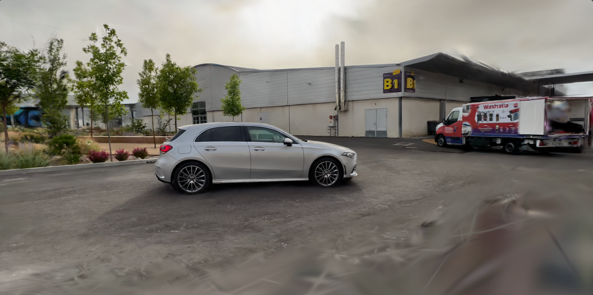

<h1 align="center">AutoIso</h1>

AutoIso extracts per-view masks from a trained 3D Gaussian Splatting scene, enabling you to train a new 3DGS model that features only the car.  It:

 1. Stat‑culls Gaussians outside the .2‑σ band (signal‑to‑noise trim).

 2. Re‑renders every camera view to produce clean RGB frames.

 3. Extracts car-only masks (foreground car, background suppressed).

Using these masks, you can then train a new 3DGS model that contains only the car.

<p align="center">
  
  
</p>

## 💾 Installation

### 1. Create & activate the Conda environment
```bash
conda create -n autoIso python
conda activate autoIso
```
### 2. Install dependencies

```bash
# Change directories to project root (gCull/):
cd <project-dir: autoIso>

# Install SAM2, & CLIP
# This will also install a CUDA-enabled version of PyTorch (based on pip defaults)
pip install -r requirements.txt

# Install the autoIso package and its CLI entrypoints:
pip install .
```

### 3. Download SAM2 weights for semantic masks
```bash
cd ..  # Return to project root
mkdir -p models
wget https://dl.fbaipublicfiles.com/segment_anything_2/092824/sam2.1_hiera_large.pt -P models
```

## 📂 File Structure (Input Layout)

The tool requires the following structure:

```text
gCull/
├── data/
│   └── <experiment-name>/
│       ├── colmap/
│       ├── images/            ← put your source JPG/PNG files here
│       └──  transforms.json
|
├── outputs/
│   └── <experiment-name>/
│       └── splatfacto/
│           └── <model-name>/
│               └── config.yml ← if using Splatfacto, point to this config file for `isolate-car`
│
├── models/                    ← where SAM2 weights will be downloaded
```

## 🚀 Execution

From your project root:

```
autoiso isolate-car \
  --load-config <path/to/config.yml>
```
The masks will be stored under ```data/<experiment-name>```

## 🛠️ Acknowledgements

This work is built upon and heavily modifies the Nerfstudio/Splatfacto codebases.
